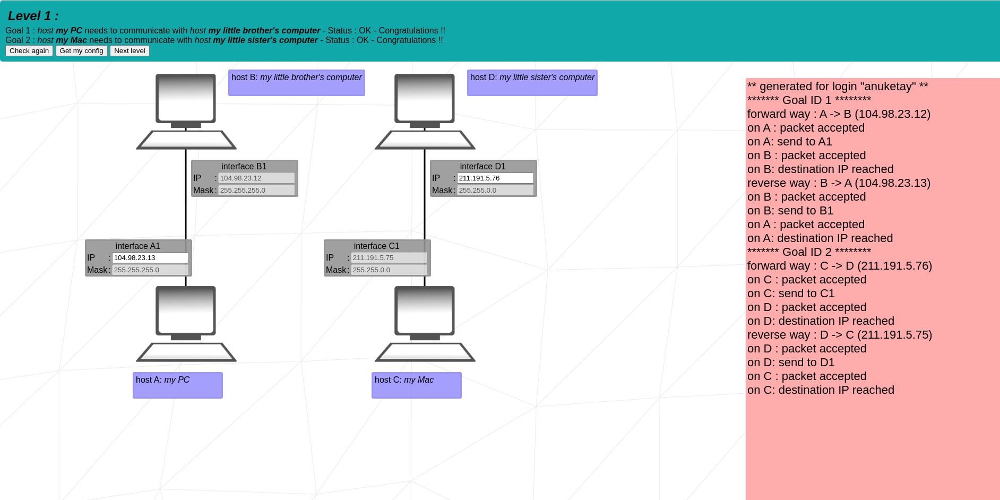
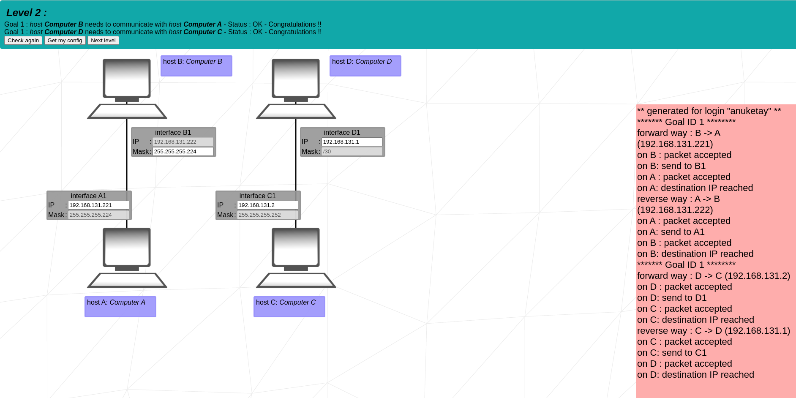
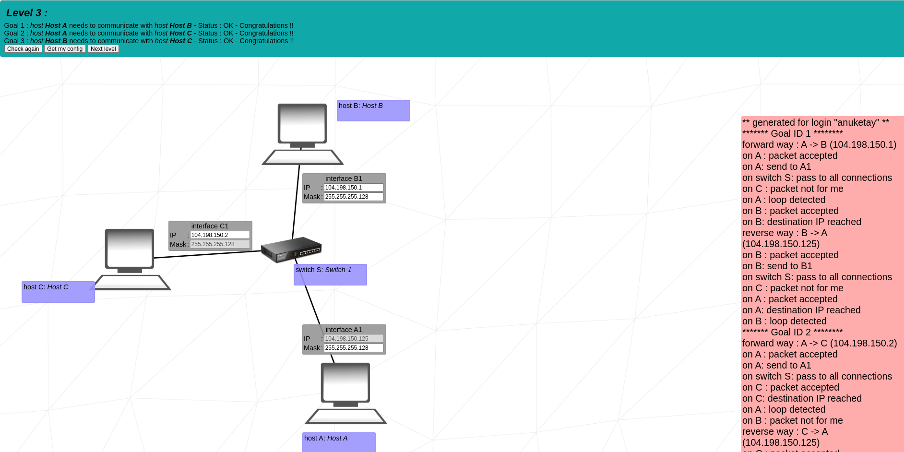
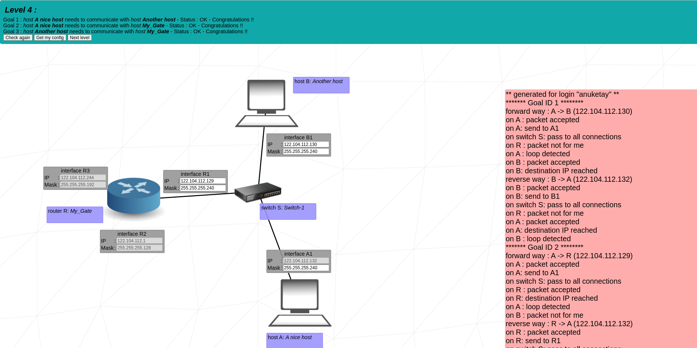
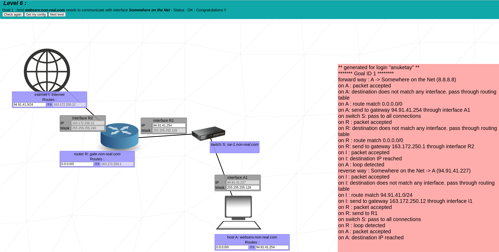
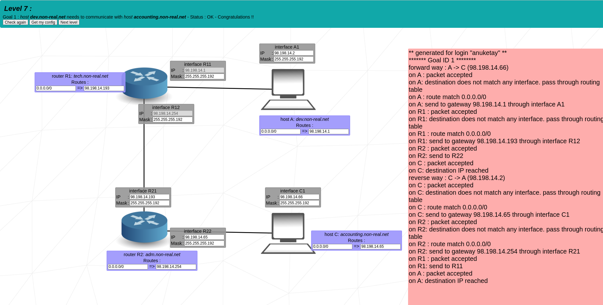
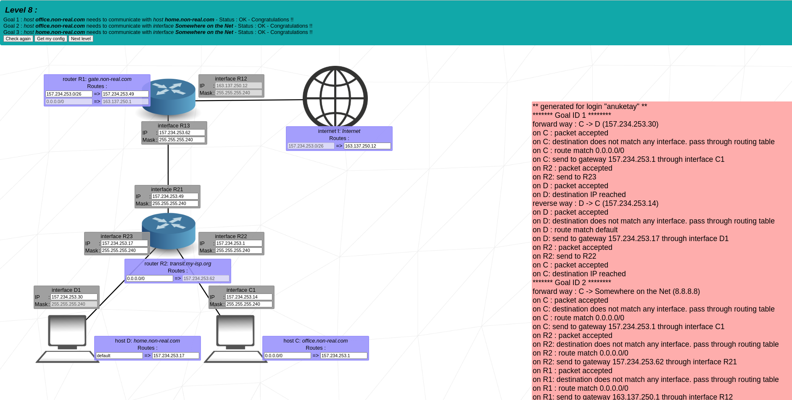
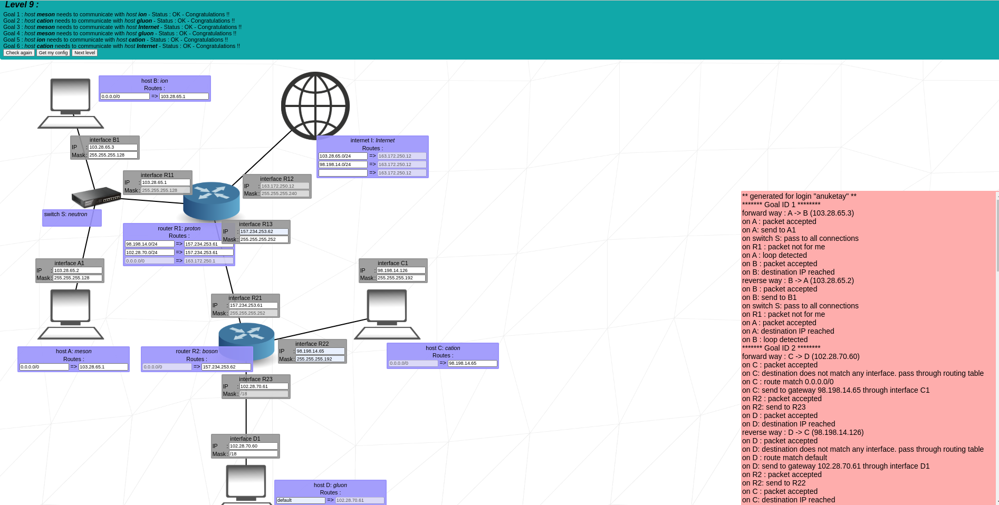
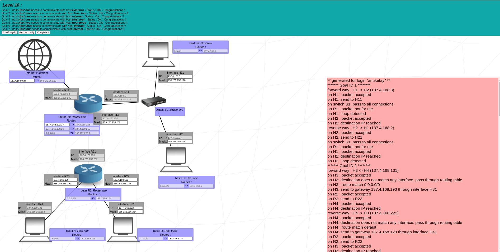

# NetPractice

Welcome to NetPractice! :)

## Description

NetPractice is a project that allows you to practice network configuration. You can practice by entering your login in the field or try the 'correction' version by leaving the field empty.

There are 10 levels available for training. For each level, a non-functional network diagram will appear. At the top of your window, you will see a goal to achieve, which outlines the issues to solve for the network to function properly. There are two buttons you can use:
- Check again to verify if your configuration is correct or not.
- Get my config to download your configuration whenever necessary. It will be useful to turn in your assignment.

Upon successfully completing a level, a new button will appear. Click on this button to get to the next level. Before proceeding to the next level, ensure you export your configuration using the Get my config button so you can put it in your Git repository.

At the bottom of the page, logs are displayed. They can be helpful to understand why your configuration is not functioning.

## How to Use

To succeed, adjust the unshaded fields until your network configuration is correct and functional. To complete this assignment, it is strongly recommended that you understand how addressing functions in a network containing devices such as routers. Familiarize yourself with TCP/IP addressing.

## How to Download and Launch

1. Download the `netpractice` folder from the repository.
2. Open the `netpractice` folder.
3. Launch the `index.html` file in your browser.

## Solutions

Here are the solution pictures for each level:

### Level 1

### Level 2

### Level 3

### Level 4

### Level 5

### Level 6

### Level 7

### Level 8

### Level 9

### Level 10

